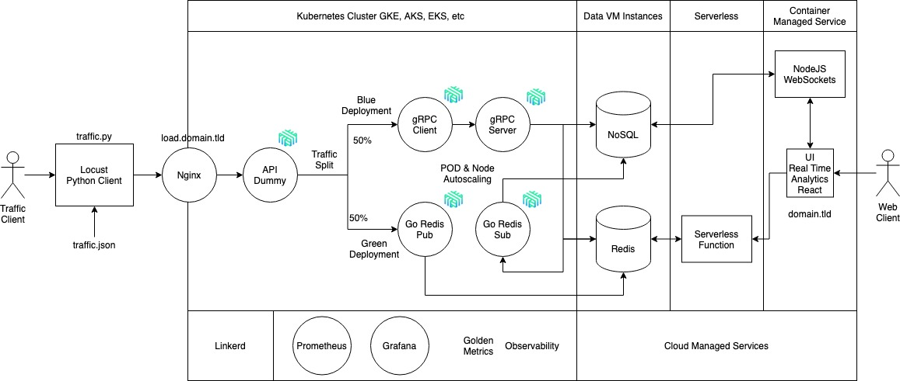

# Covid 19 - Kubernetes Architecture

### Arquitectura del Sistema:



El sistema cuenta se encuentra desplegado en Kubernetes, el cúal orquesta 6 contenedores, el primero de ellos es un Nginx-Ingress, el cual redirige a una API Dummy, la cúal se encarga de dividir el tráfico en partes iguales hacia los 2 despliegues, conformado cada uno por 2 contenedores, uno utilizando tecnologías de gRPC y en otro Redis pub/sub, utilizados como brokers.

### gRPC:

Es un sistema de llamada a procedimiento remoto (RPC) de código abierto desarrollado inicialmente en Google. Utiliza como transporte HTTP/2 y Protocol Buffers como lenguaje de descripción de interfaz. Proporciona características como autenticación, transmisión bidireccional y control de flujo, enlaces bloqueantes o no bloqueantes, cancelaciones y tiempos de espera. Genera enlaces multiplataforma entre cliente y servidor para muchos lenguajes. Entre los caso de uso más comunes, incluye la conexión de servicios en la arquitectura microservicios y la conexión de dispositivos móviles, navegador clientes a los servicios backend.

### Redis:

Redis es un motor de base de datos en memoria, basado en el almacenamiento en tablas de hashes (clave/valor) pero que opcionalmente puede ser usada como una base de datos durable o persistente.

### Bases de Datos:

Los datos son almacenados en 2 instancias que cuentan con MongoDB y Redis, con la diferencia que MongoDB cuenta con persistencia de datos, al estar en Mongo Atlas, Redis al ser una base de datos en memoria no almacena datos de valor a largo plazo, ya que una vez se apague la instancia, estos datos se perderan.

Los datos que se almacenan cuentan con la siguiente estructura, los cuales son registros de personas infectadas por covid-19.

```c
[
	{
		"name":"Pablo Mendoza"
		"location":"Guatemala City"
		"age":35
		"infected_type":"communitary"
		"state": "asymptomatic"
	}
]
```

### Observabilidad y Monitoreo:

Para la observabilidad y monitoreo de los contenedores se utiliza Linkerd, el cúal brinda los datos sobre el estado del tráfico de datos, la capacidad de los contenedores, entre otras métricas.

Prometheus y Grafana son utilizados de igual forma, Prometheus para obtener los datos de la máquina y son graficados y presentados de manera más amigable por medio de Grafana.


### Generador de Tráfico

Para generar altas cantidades de tráfico se utiliza una api de Python que implementa Locust, con el cúal se puede generar el tráfico aleatorio para probar el rendimiento de la aplicación.

